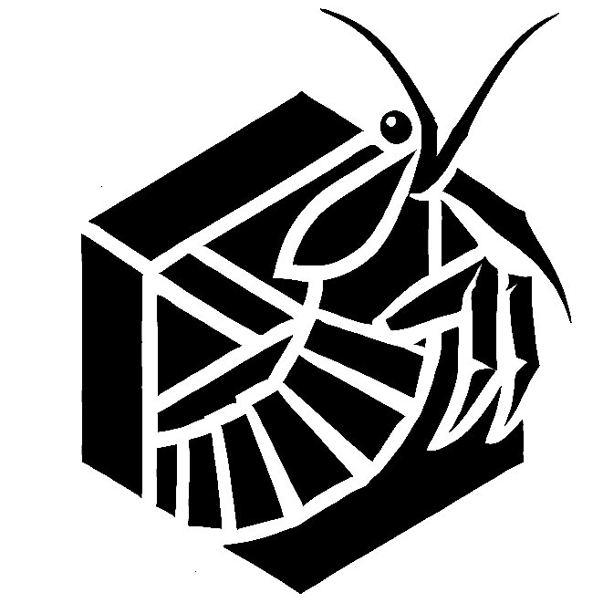

<p align="center">
  
</p>

# From PDF to Playable: Interactive Graphics Lab Examples

This repository contains the example webpages accompanying the paper
**“From PDF to Playable: Publishing Interactive Reference Solutions for C++ Graphics Labs with WebAssembly.”**

The pages show how C++ graphics exercises can be published as lightweight web pages with embedded, playable WebAssembly reference solutions. The goal is to move beyond static PDF-style reference material such as screenshots, plots, and videos: students can read the task description, start the instructor reference implementation, interact with it, and compare the intended behavior directly in the browser.

The examples in this repository are the web-facing artifacts from the paper. They demonstrate how existing C++/OpenGL teaching code can be compiled to WebAssembly with Emscripten and embedded into exercise pages with little to no source-level changes to the reference solution.

## Three Ideas

The paper is built around three ideas, and instructors can adopt them at different levels:

1. **Use WebAssembly for graphics exercises.** Even without using our code, the paper raises awareness that WebAssembly and WebGL make it practical to publish interactive C++/OpenGL reference behavior directly in the browser.
2. **Reuse the framework and scaffolding.** Instructors who already have their own assignments can use the framework layer to bridge native C++/OpenGL code and browser-based WebAssembly deployments.
3. **Reuse complete exercises.** Instructors who want ready-made material can copy, adapt, or remix the example exercises and webpages in this repository and the related course repositories.

All of these use cases are welcome. You might only be interested in WebAssembly as a deployment technology, you might want to use the framework for your own exercises, or you might want to take entire exercises as a starting point for a course.

## What Is In This Repository?

The repository is a self-contained static/SSI website with four course areas:

- `AIS/` — Advanced Image Synthesis
- `CG/` — Computer Graphics
- `CGM/` — Computer Graphics Methods
- `VIS/` — Visualization

The shared page frame lives in:

- `_top.shtml`
- `_bottom.shtml`
- `assets/`

The included `serve_ssi.py` helper can be used to preview the pages locally with server-side includes enabled.

## What `serve_ssi.py` Does

The file `serve_ssi.py` is a small local development server for this repository. It serves the website over HTTP and expands the server-side include directives used by the `.shtml` files, for example the shared `_top.shtml` and `_bottom.shtml` page fragments.

This means you can preview the repository locally in the same structure that a web server with SSI support would provide. It is only a convenience tool for local testing and demonstration; the exercise pages themselves are static files plus WebAssembly/JavaScript assets.

## Related Repositories

This repository contains the **example webpages** from the paper. The corresponding exercise source code lives in the following repositories:

- [JensDerKrueger/Vis](https://github.com/JensDerKrueger/Vis)
- [JensDerKrueger/AIS](https://github.com/JensDerKrueger/AIS)
- [JensDerKrueger/CG](https://github.com/JensDerKrueger/CG)
- [JensDerKrueger/CGM](https://github.com/JensDerKrueger/CGM)

The utility framework layer discussed in the paper is available here:

- [JensDerKrueger/Utils](https://github.com/JensDerKrueger/Utils)

## Running Locally

Because the pages use `.shtml` includes, use the provided helper instead of opening the files directly:

```bash
python3 serve_ssi.py --host 127.0.0.1 --port 8000
```

Then open:

```text
http://127.0.0.1:8000/
```

If port `8000` is already in use, choose another port:

```bash
python3 serve_ssi.py --host 127.0.0.1 --port 8001
```

## Customizing The Theme

The site is intentionally simple to adapt. To change the theme, page chrome, or institutional branding, edit:

- `_top.shtml`
- `_bottom.shtml`
- `assets/styles.css`
- `assets/exercise.css`
- `assets/solution.css`

The individual course and exercise pages can stay focused on content while the shared header, footer, and visual styling live in those common files.

## License

The exercises are MIT licensed. In practical terms, you can use, copy, modify, publish, distribute, sublicense, and adapt them for your own teaching material or projects.

See the related exercise repositories for the corresponding source code and license details.
